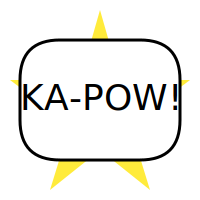

# Comic Store - Next.js E-commerce Application



Welcome to the Comic Store! This is a full-stack e-commerce application built for comic book enthusiasts, allowing users to browse, purchase, and manage their favorite comics. Built with modern web technologies, it provides a seamless and engaging user experience.

This project utilizes:

* **Framework:** [Next.js](https://nextjs.org/) (App Router)
* **Styling:** [Tailwind CSS](https://tailwindcss.com/)
* **UI Components:** [Shadcn/ui](https://ui.shadcn.com/)
* **Language:** [TypeScript](https://www.typescriptlang.org/)
* **ORM:** [Prisma](https://www.prisma.io/)
* **Database:** [PostgreSQL](https://www.postgresql.org/) (Neon DB)
* **Authentication:** [NextAuth.js](https://next-auth.js.org/)
* **State Management:** React Server Components, Server Actions, `useTransition`, `useActionState`
* **Payments:** [PayPal](https://developer.paypal.com/home/)

## Features

* **Product Catalog:** Browse a collection of comics with details, images, and pricing. ([`app/(root)/comic/[slug]/page.tsx`](app/(root)/comic/[slug]/page.tsx))
* **User Authentication:** Secure sign-up and sign-in functionality using credentials. ([`app/(auth)/sign-in/page.tsx`](app/(auth)/sign-in/page.tsx), [`app/(auth)/sign-up/page.tsx`](app/(auth)/sign-up/page.tsx), [`auth.ts`](auth.ts))
* **Shopping Cart:** Add/remove comics, update quantities, and view cart summary. ([`app/(root)/cart/page.tsx`](app/(root)/cart/page.tsx), [`lib/actions/cart.actions.ts`](lib/actions/cart.actions.ts))
* **Checkout Process:** Multi-step checkout including shipping address ([`app/(root)/heroes-address/page.tsx`](app/(root)/heroes-address/page.tsx)), payment method selection ([`app/(root)/payment-method/page.tsx`](app/(root)/payment-method/page.tsx)), and order placement ([`app/(root)/place-order/page.tsx`](app/(root)/place-order/page.tsx)).
* **Order Management:** View past orders and order details. ([`app/user/orders/page.tsx`](app/user/orders/page.tsx), [`app/(root)/order/[id]/page.tsx`](app/(root)/order/[id]/page.tsx))
* **Payment Integration:** Process payments using PayPal. ([`app/(root)/order/[id]/order-details-table.tsx`](app/(root)/order/[id]/order-details-table.tsx))
* **User Profile:** Basic user profile section. ([`app/user/profile/page.tsx`](app/user/profile/page.tsx))
* **Theme Toggle:** Switch between light and dark modes. ([`components/shared/header/mode-toggle.tsx`](components/shared/header/mode-toggle.tsx))
* **Responsive Design:** Adapts to various screen sizes using Tailwind CSS.

## Getting Started

Follow these instructions to get a copy of the project up and running on your local machine for development and testing purposes.

### Prerequisites

* Node.js (v18 or later recommended)
* npm or yarn or pnpm
* PostgreSQL Database (or use the Neon DB connection string provided in `.env`)

### Installation

1. **Clone the repository:**

    ```bash
    git clone <your-repository-url>
    cd <repository-directory>
    ```

2. **Install dependencies:**

    ```bash
    npm install
    # or
    yarn install
    # or
    pnpm install
    ```

3. **Set up environment variables:**
    * Create a `.env.local` file in the root directory by copying the existing `.env` file:

        ```bash
        cp .env .env.local
        ```

    * Update the variables in `.env.local` as needed, especially:
        * : Your PostgreSQL connection string.
        * `NEXTAUTH_SECRET`: Generate a strong secret (`openssl rand -base64 32`).
        * : Your PayPal Sandbox/Live Client ID.
        * `PAYPAL_APP_SECRET`: Your PayPal Sandbox/Live App Secret.
        * Ensure `NEXT_AUTH_URL` points to your local development URL (e.g., `http://localhost:3000`).

4. **Database Setup:**
    * Generate Prisma Client:

        ```bash
        npx prisma generate
        ```

    * Push schema changes to the database:

        ```bash
        npx prisma db push
        ```

    * (Optional) Seed the database with sample data:

        ```bash
        npx ts-node db/seed.ts
        ```

5. **Run the development server:**

    ```bash
    npm run dev
    # or
    yarn dev
    # or
    pnpm dev
    ```

Open [http://localhost:3000](http://localhost:3000) with your browser to see the application.

## Available Scripts

In the project directory, you can run:

* `npm run dev`: Runs the app in development mode with Turbopack.
* `npm run build`: Builds the app for production.
* `npm run start`: Starts the production server.
* `npm run lint`: Lints the codebase using Next.js' built-in ESLint configuration.
* : Runs tests using Jest.
* : Runs tests in watch mode.
* `npx prisma generate`: Generates Prisma Client based on your schema.
* : Pushes schema changes to the database (for development).
* `npx ts-node db/seed.ts`: Seeds the database with initial data.

## Environment Variables

This project requires the following environment variables to be set (refer to the  file for a full list):

* : Connection string for your PostgreSQL database.
* `NEXTAUTH_SECRET`: Secret used by NextAuth.js for session encryption.
* `NEXT_AUTH_URL`: The canonical URL of your application.
* : Your PayPal application Client ID.
* `PAYPAL_APP_SECRET`: Your PayPal application Secret.
* `PAYPAL_API_URL`: PayPal API endpoint (Sandbox or Live).
* : Public name of the application.
* : Public URL of the server.

## Deployment

The easiest way to deploy this Next.js application is to use the [Vercel Platform](https://vercel.com/new).

Ensure you set up the required environment variables in your Vercel project settings.

For more details, check out the [Next.js deployment documentation](https://nextjs.org/docs/app/building-your-application/deploying).
